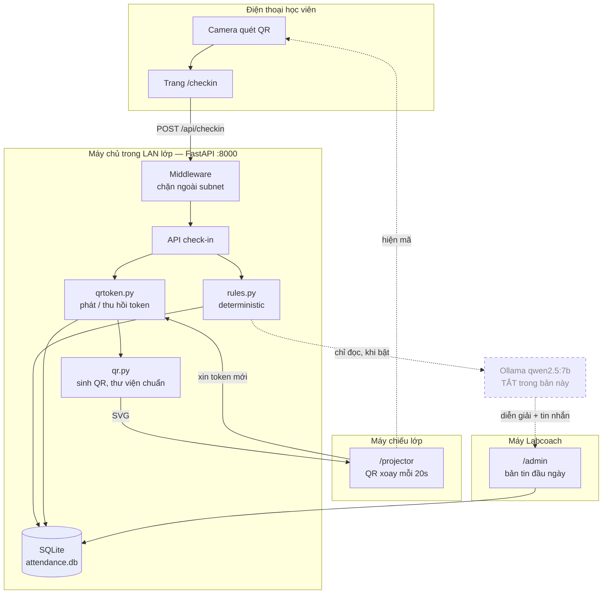
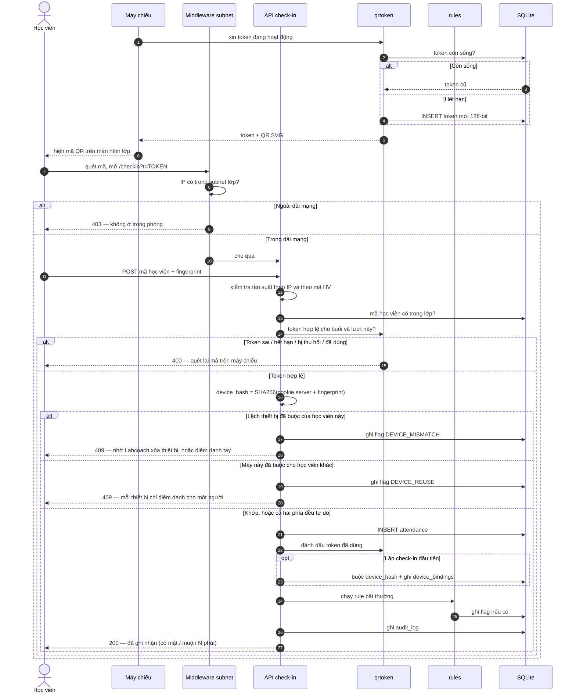
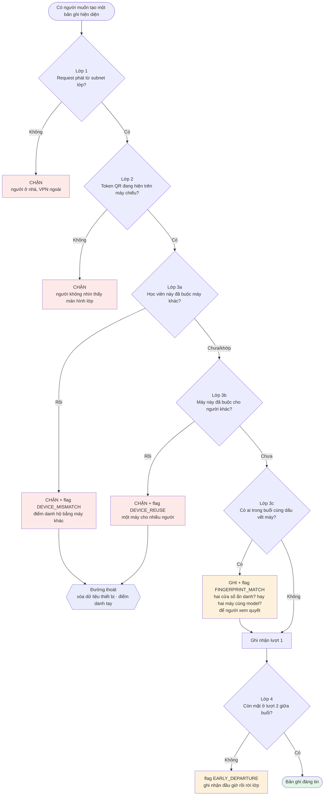
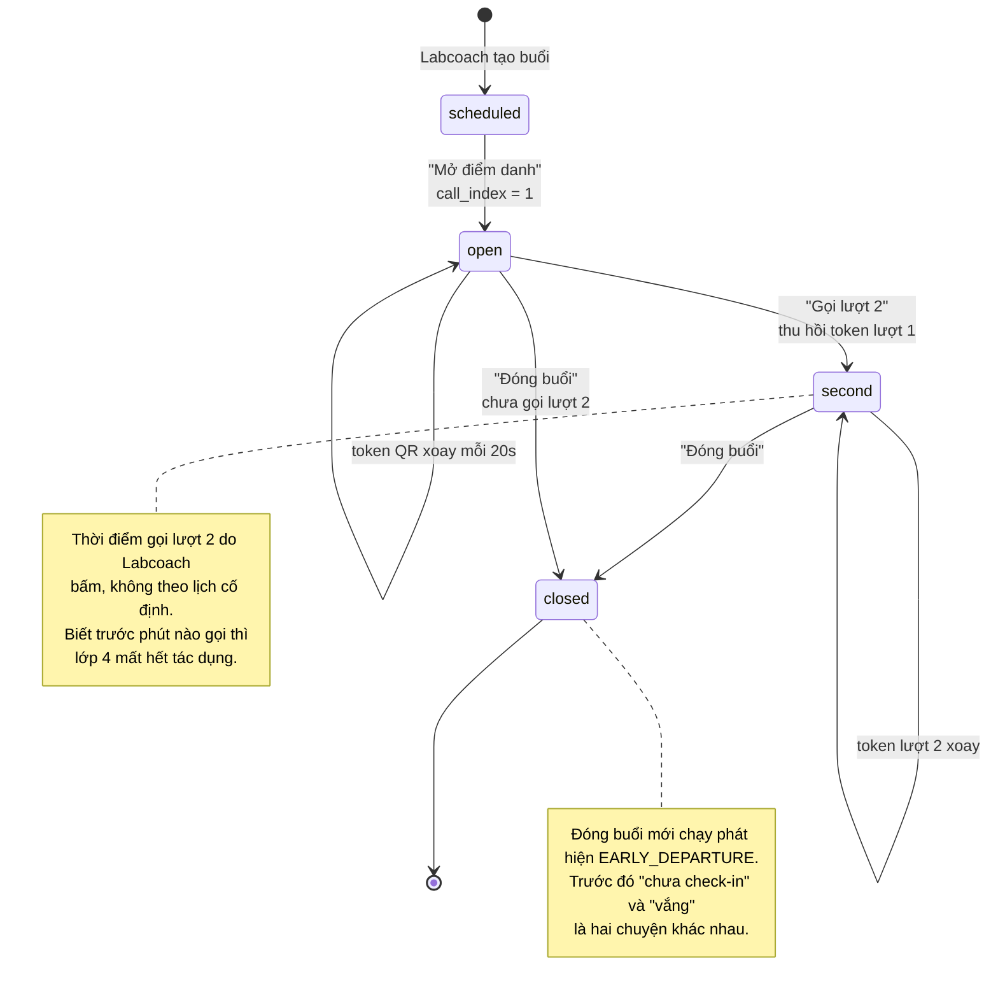
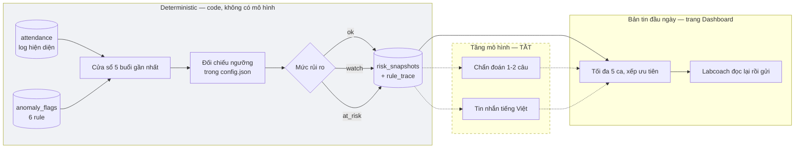
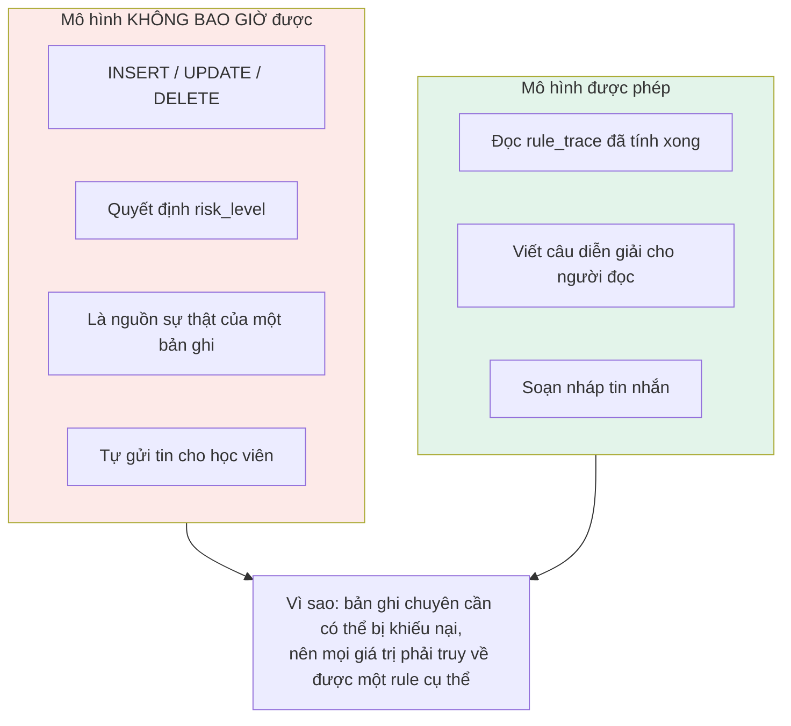
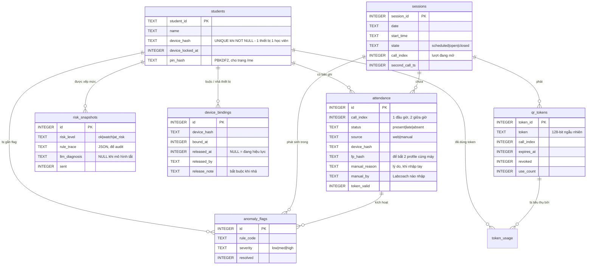
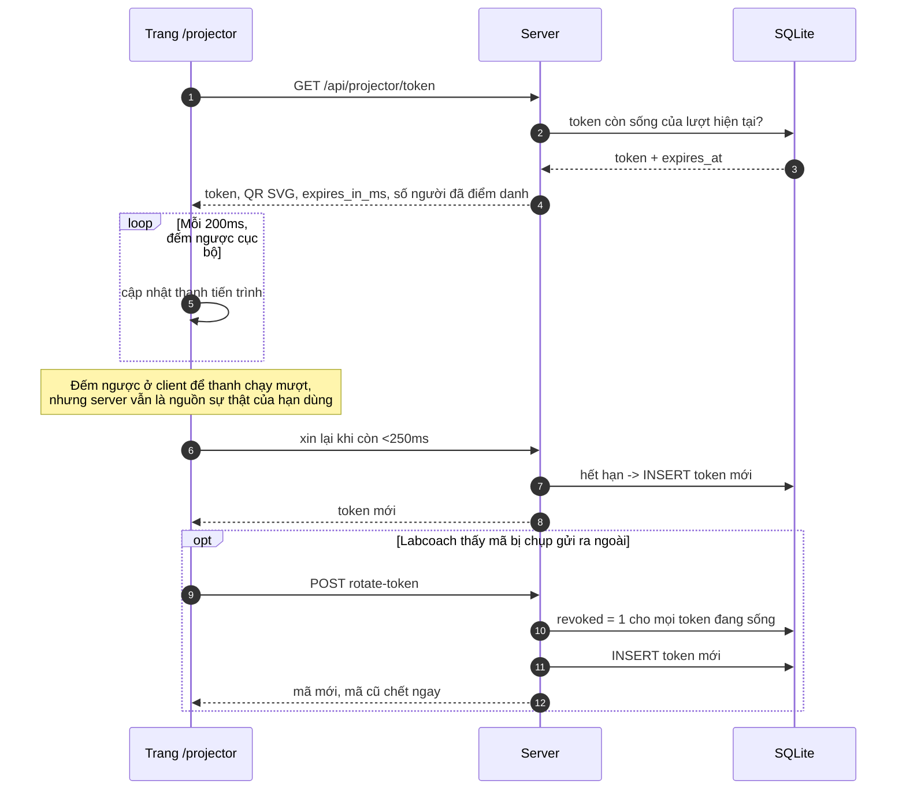
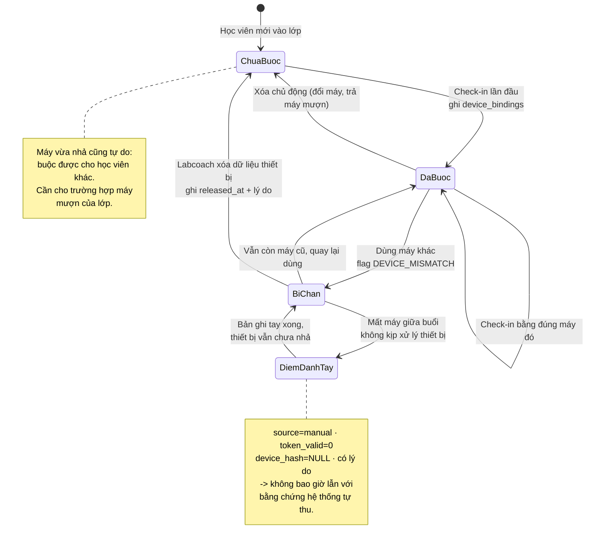
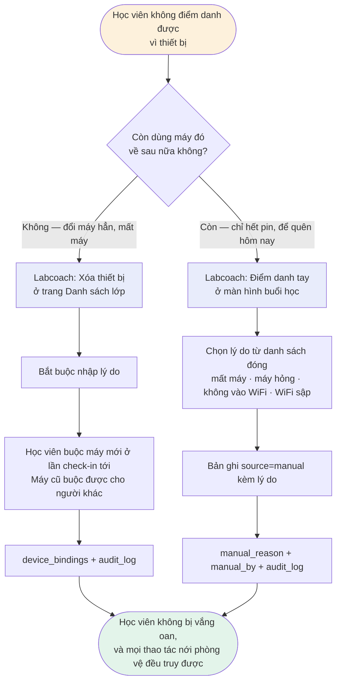

# Luồng hệ thống — sơ đồ

Sơ đồ mermaid cho toàn bộ hệ thống chuyên cần. Đọc kèm `spec.md` §4.

Tầng mô hình ngôn ngữ **tắt** trong bản dựng này; chỗ nó sẽ nối vào được vẽ bằng
nét đứt để thấy ranh giới đã được giữ nguyên.

---

## 1 · Kiến trúc

Không có dịch vụ ngoài. Không API key. Toàn bộ chạy trên một máy trong LAN lớp học.

---

## 2 · Luồng check-in đầy đủ

---

## 3 · Bốn lớp xác thực hiện diện

Mỗi lớp chặn một kiểu gian lận khác nhau, và không lớp nào tự đủ.

Đỏ = chặn trước khi ghi. Vàng = vẫn ghi nhưng để lại flag cho người xem.

**Hai lỗ còn lại, nói thẳng:**

1. **Chụp màn hình gửi cho bạn ở ngoài.** Bạn đó vẫn phải ở trong subnet lớp
   (lớp 1) và vẫn phải dùng đúng thiết bị đã buộc của chính chủ (lớp 3), nên
   đường này chỉ mở khi hai người cùng ở trong phòng và chuyền máy cho nhau —
   lúc đó lớp 3b chặn kèm flag `DEVICE_REUSE` mức high.
2. **Hai cửa sổ ẩn danh trên một điện thoại.** Mỗi cửa sổ một cookie nên
   `device_hash` khác nhau, server không có cách nào biết là cùng một máy. Chỉ
   **phát hiện** được qua `FINGERPRINT_MATCH`, không chặn — vì hai máy cùng model cũng
   cho fingerprint giống nhau, chặn là chặn oan bạn cùng lớp.

---

## 4 · Vòng đời buổi học

---

## 5 · Từ log hiện diện tới bản tin đầu ngày

Khi tầng mô hình tắt, `top` vẫn đầy đủ: mức rủi ro và `rule_trace` là phần
deterministic. Mất đi là câu diễn giải và tin nhắn soạn sẵn — Labcoach tự viết
dựa trên khối "Vì sao" hiện trên dashboard.

**Không có luồng nào tự động gửi.** `human` là mắt bắt buộc trong chuỗi.

---

## 6 · Ranh giới quyền của mô hình

Ràng buộc này được giữ ở tầng code: `llm.py` không nhận tham số `conn`, nên
không có đường nào để tầng mô hình ghi vào database.

---

## 7 · Quan hệ dữ liệu

---

## 8 · Máy chiếu xoay token

---

## 9 · Vòng đời thiết bị của một học viên

## 10 · Hai đường thoát khi thiết bị không dùng được

Lý do nhập tay là **danh sách đóng**, không phải ô gõ tự do: cuối khoá phải đếm
được "bao nhiêu buổi mất vì máy hỏng", mà lý do gõ tay thì không tổng hợp được.
